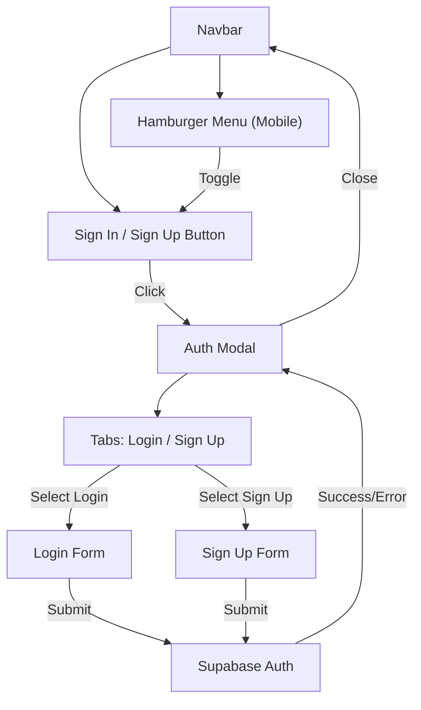

# Plan: Optimize Login and Navbar with Modal Authentication & Hamburger Menu

## Objective
- Replace the current login/signup dropdowns in the navbar with a modal popup for authentication.
- Add a responsive hamburger menu for mobile navigation.

---

## Steps

### 1. Remove Dropdowns from Navbar
- Delete the current login and signup dropdown HTML from the navbar.
- Remove related CSS for `.dropdown-content` and dropdown positioning.
- Remove or refactor any JavaScript that toggles dropdowns.

### 2. Add a Single Auth Button
- Add a single "Sign In / Sign Up" button to the navbar (right-aligned).
- This button will open the authentication modal.

### 3. Implement Modal Popup
- Create a modal component in HTML, hidden by default.
- Modal contains:
  - Tabs or toggle for "Login" and "Sign Up"
  - Email and password fields for each
  - Submit buttons for each action
  - Area for auth messages (success/error)
  - Close button (X)
- Modal should be centered, with a darkened background overlay.

### 4. Style the Modal
- Use CSS to ensure the modal matches the site's color scheme and is visually prominent.
- Modal and overlay should be fully responsive (mobile-friendly).
- Prevent background scrolling when modal is open.

### 5. Update JavaScript Logic
- Add functions to open/close the modal.
- Add logic to switch between login and signup forms within the modal.
- Reuse or adapt existing Supabase authentication functions for modal forms.
- Ensure auth messages are displayed in the modal.
- Optionally, close the modal on successful login.

### 6. Implement Hamburger Menu for Mobile
- On small screens, collapse the navbar into a hamburger icon.
- Clicking the hamburger toggles the navigation links and the "Sign In / Sign Up" button.
- Ensure the modal auth button is accessible from the hamburger menu.
- Style the hamburger menu and mobile nav for consistency and usability.

### 7. Clean Up Old Code
- Remove unused dropdown-related CSS and JS.
- Test for any lingering references to the old dropdowns.

---

## Mermaid Diagram: New Navbar & Modal Auth Flow

---

## Key Benefits

- Navbar remains clean and uncluttered on all screen sizes.
- Modal provides a focused, user-friendly authentication experience.
- Improved mobile responsiveness and visual integration.
- Hamburger menu ensures easy navigation on mobile devices.